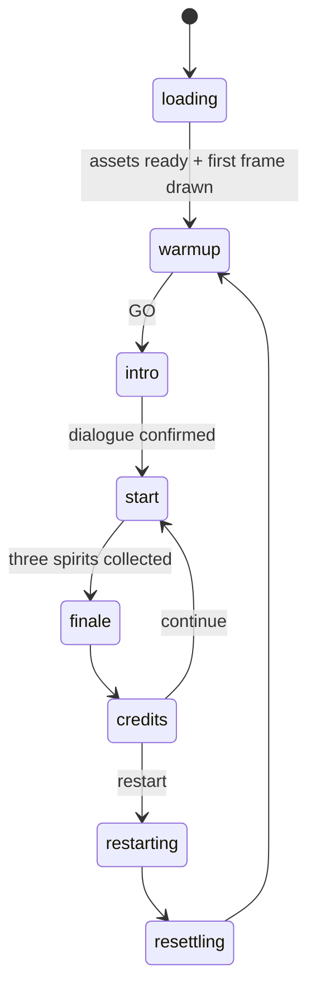

# Architecture

A technical walkthrough of Utanomori: how the app is assembled, what happens on a frame, and the
constraints that are not obvious from reading any single file.

Written to be useful cold, to someone who just forked this. Every rule below is stated with the
symptom you get for breaking it, because most of them fail quietly rather than loudly.

**Contents**
[1. Map](#1-map) ·
[2. Boot](#2-boot-sequence) ·
[3. A frame](#3-what-happens-in-a-frame) ·
[4. The world](#4-the-world) ·
[5. Materials & shaders](#5-materials-and-shaders) ·
[6. Shared per-frame state](#6-shared-per-frame-state) ·
[7. Themes](#7-themes) ·
[8. Game flow](#8-game-flow) ·
[9. Audio](#9-audio) ·
[10. Config & store](#10-config-and-store) ·
[11. The debug panel](#11-the-debug-panel) ·
[12. Constraints](#12-constraints) ·
[13. Recipes](#13-recipes)

---

## 1. Map

Three composition tiers, then everything else:

```
src/index.jsx      DOM root. Renders <Loader/> + a lazy <App/>. No 3D.
src/App.jsx        <Canvas>, the DOM HUD, audio wiring, the progress bridge.
src/Experience.jsx The scene graph — composition only, no behaviour.
```

| folder | owns |
| --- | --- |
| `loader/` | the loading screen. **Compiled into the entry chunk** (§12.1) |
| `world/` | scene behaviour. One component per thing that exists or moves |
| `world/fields/` | pure seeded samplers: grass patches, roads, prop placement |
| `world/state/` | render-free per-frame singletons (§6) |
| `world/utils/` | geometry baking, the batched-mesh pool, screen scaling |
| `materials/` | a `create<X>Material` + `update<X>Material` pair per material |
| `shaders/` | one folder per effect; `includes/` holds shared GLSL |
| `postprocessing/` | the single full-screen pass |
| `game/` | phase director, dialogue, mini-game orchestration, camera rig |
| `audio/` | AudioContext, music layers, one-shots, ambience |
| `stores/` | seven zustand stores. Plumbing — no tuning values |
| `config/` | every tunable number, plus themes and character definitions |
| `ui/` | DOM overlays |
| `debug/` | the Leva panel (§11) and the loader alignment overlay |

**Naming conventions.** `use*.jsx` is a hook or a store. `<Name>Material.js` exports a
create/update pair. A component file's name matches its default export. Uniforms are `u*`,
attributes `a*`, varyings `v*` — no exceptions outside the post pass, where the post-processing
library binds `inputBuffer` and `resolution` by name.

---

## 2. Boot sequence

The bundle is split in two on purpose: a **~193 KB entry chunk** containing no three.js, and a
**~1.6 MB world chunk** behind it.

1. `index.html` paints a static HTML/CSS loading ring before any JavaScript runs. Its background
   matches the loader curtain exactly, so the first paint is already the right colour.
2. The entry chunk boots: `index.jsx` installs the CSS palette variables and renders
   `<Loader/>` alongside `<Suspense><App/></Suspense>`.
3. `App.jsx` — the world chunk — evaluates. Its **module body** chains progress handlers onto
   three's `DefaultLoadingManager` and writes into `stores/useLoaderShell.jsx`, which the
   three-free Loader reads. It also registers audio callbacks into `game/loaderBridge.js` and
   starts the cicada ambience.
4. Assets load. The Loader eases a displayed percentage that never exceeds real progress and never
   finishes in under three seconds.
5. When assets are done **and** the scene has actually drawn a frame, the phase moves to `warmup`
   — the GO screen, which is the live scene viewed top-down through a transparent curtain.
6. GO resumes the AudioContext, starts the music layers, and hands off to the intro travel.

Two structural details in that sequence:

- **The Loader is a sibling of `<Suspense>`, not a child.** R3F's `<Canvas>` re-throws suspension
  into the *outer* tree while GLBs load. A Loader inside that boundary renders nothing for the
  whole load.
- **Progress handlers are chained, never assigned** (`loader/loadingManagerChain.js`).
  `DefaultLoadingManager.onStart/onProgress/onLoad/onError` are plain writable slots on a
  singleton, and more than one library assigns them; the last module evaluated wins. Chaining
  preserves whoever else is listening. Covered by tests in `tests/loadingManagerChain.test.js`.

---

## 3. What happens in a frame

R3F runs `useFrame` callbacks in **mount order**, which is the order of `Experience.jsx`'s
children. That order is load-bearing:

```
Terrain ─────────► streams chunks, drives the theme mask, updates ground/grass uniforms
MainCharacter ───► reads input, moves the hero, MOVES THE CAMERA, publishes his screen disc
Companions ──────► sheep follow the hero's recorded trail, publish their screen discs
MusicStones ─────► stages the mini-game, projects stones against the camera
PostProcessing ──► reads the theme mask, applies grade + grain
```

Two ordering rules follow:

- **Anything that projects to screen space must run after the camera moves.** See-through discs
  are computed from the camera matrices `MainCharacter` just set; running earlier makes them lag
  by a frame.
- **A child's `useFrame` runs before its parent's.** `SheepCreature` executes before the
  `Companions` wrapper that positions it, so on the first frames it would publish a position that
  has not been set yet. The `>= 2` frame counters in those components gate against exactly that
  (§12.3).

---

## 4. The world

**The ground is flat.** `y = 0` everywhere; no heightmap, no vertex displacement. Each chunk's
plane is subdivided 19×19 solely to carry a per-vertex road-distance attribute the fragment shader
interpolates — it is not terrain detail, and reducing it degrades the road edge.

**Chunks.** A 5×5 grid of 9-unit chunks stays resident around the hero. When you cross a boundary
the new chunks are queued and built **one per frame**; existing ones stay alive until their
replacements are ready, so there is no gap and no multi-chunk spike.

**Placement is a pure function of world position.** `world/fields/` holds seeded samplers — grass
patches, the meandering road, prop groups. Ask for a coordinate, get the same answer every time, on
every machine, with no stored data. Neighbouring chunks agree at their seams for free.

**Grass** is one instanced draw per chunk: 1,600 blades, ~40,000 resident. The geometry has **no
position attribute** — each blade is built in the vertex shader from `gl_VertexID`. Two
consequences:

- the bounding sphere is set **by hand**, because three cannot compute one without positions;
- blades inside a prop's clearance radius are collapsed to degenerate triangles by setting
  `gl_Position.w = 0`, which removes them without paying for a fragment discard.

**Props** — every tree, stone and mushroom across all chunks — live in a single `BatchedMesh`
(capacity 4,096), so the forest costs roughly one draw call. Tree eye planes use a second batched
pool.

**What is baked vs. computed.** Attributes carry *identity*; uniforms carry *appearance*. A grass
blade bakes which tint family it belongs to and its tone — never a colour. Recolouring the whole
field is therefore a uniform write, not a rebuild. Adding a colour to a chunk's generation key
would rebuild every chunk on every colour change.

---

## 5. Materials and shaders

Four hand-written `ShaderMaterial`s cover almost everything drawn: character, prop, terrain, grass.
Each is built by a `create*` function and refreshed by an `update*` function that takes an options
object — never by rebuilding the material.

The painterly look comes from **one brush texture**, sampled three different ways depending on what
is being painted:

| surface | sampling | texture |
| --- | --- | --- |
| character, props | object-space triplanar (`vObjectPosition * scale`) | the raw brush |
| ground, grass | world-space (`worldXZ * drift`) | a **baked** copy |
| prop dissolve edges | blended toward screen-space | the raw brush |

Ground and grass read a copy that is blurred, levelled and contrast-adjusted once into a render
target at load (`world/utils/useBakedPainteryTexture.js`), so their large flat areas merge into
painterly regions; characters and props sample the source brush directly. Two uniform names encode
the split — `uPainteryTexture` is the baked one, `uPainterlyTexture` the raw one.

The screen-anchored blend exists only on the reveal-circle and see-through edges of props, where a
purely object-space dither would streak across a non-planar surface as the edge sweeps past.

The only full-screen pass (`postprocessing/`) does a display colour grade (LOW/HIGH presets, the
in-game sun/moon) and film grain, applied last so nothing filters it.

Shared GLSL lives in `shaders/includes/`, pulled in with `#include`:

| include | provides |
| --- | --- |
| `themeMask.glsl` | the screen-space old→new blend factor (§7) |
| `seeThrough.glsl` | see-through uniforms, arrays and `seeThroughAmount()` |
| `dither.glsl` | the 8×8 Bayer threshold and `shouldDiscard()` |
| `paintedEdge.glsl` | the brush-textured dissolve edge |
| `simplexNoise2d.glsl` | Ashima simplex noise (used by both eye shaders) |
| `easeOut.glsl`, `hash3.glsl` | small helpers |

`vite-plugin-glsl` inlines includes textually with no guards, so **`seeThrough.glsl` must be
included after the file's varyings** (it reads `vWorldPos`) and no file may include the same helper
twice.

**Texture instances are shared.** drei's `useTexture` caches by URL, so the four components that
load the brush texture receive the *same* Texture objects and each writes its own filter settings
onto them; the component that renders last decides what the GPU gets. Unifying those call sites
into one hook, or reordering `Experience.jsx`'s children, changes the result. The note lives in
`world/Terrain.jsx`.

---

## 6. Shared per-frame state

`world/state/` holds eleven plain module-scope objects that per-frame code mutates in place and
shaders read directly. They are outside React and outside the store deliberately: this is data that
changes 60×/second, and routing it through either would re-render the scene graph every frame.

The pattern is **one writer per value, many readers** — but it comes in two shapes, and confusing
them is how it gets broken:

- **Single-value modules** (`themeMask`, `revealCircle`, `screenPaintery`, `characterHead`,
  `musicStonePointer`, `companionTrail`, `seeThrough`) have exactly one writing component.
- **Slot-partitioned buffers** (`trampleField`, `groundShadowField`, `characterSeeThrough`) have
  *several* writers by design — the hero, the target spirit and each follower all write. What
  makes that safe is that each owns a **fixed index**, claimed on mount and released on unmount.
  The `TRAMPLE_SLOT_*` constants and `claimCharacterSeeThroughSlot()` are the enforcement.

So the rule is: never write a value someone else writes, and never write a slot you did not claim.
`world/state/README.md` carries the ownership table.

| module | carries |
| --- | --- |
| `themeMask` | the day/night transition mask + snapshot of the outgoing palette |
| `seeThrough` | tunables shared by all see-through writers |
| `characterSeeThrough`, `musicStoneSeeThrough` | screen discs for the hero/sheep and the stones |
| `trampleField` | who is pressing the grass down, and where |
| `groundShadowField` | soft shadow discs drawn in the terrain shader |
| `revealCircle` | the lit radius of the world |
| `screenPaintery` | screen-space brush parameters |
| `characterHead`, `musicStonePointer`, `companionTrail` | head pose, arrow target, the path sheep follow |

Buffers destined for shaders are a single `Float32Array` uploaded as a `vec4[]` uniform, mutated in
place and never reallocated. **Their layouts differ** — trample is `[x, y, z, active]`, ground
shadows `[worldX, worldZ, radius, strength]`, see-through `[centreX px, centreY px, radiusPx,
cameraDist]` — and **their sizes are hand-mirrored between JS and GLSL with nothing checking
them.** Changing a capacity means changing the array allocation *and* the `#define` *and* any
literal loop bound in the shader.

---

## 7. Themes

A colour theme is a patch applied across many parameter groups at once (`config/colorPresets.js`).
Switching does not recolour in one frame: a torn-edged circle grows from the screen centre with the
outgoing palette outside and the incoming one inside, and the world animates on both sides of the
edge.

The mechanism: every themed material carries the live value **and** an `*Old` value, plus a shared
mask uniform set. One `updateThemeMask` call per frame (from `Terrain.jsx`) drives all of them, and
each fragment blends old→new by the mask.

Two requirements follow. Every themed value must appear in `captureThemeSnapshot` — anything
missing snaps at the click instead of sweeping. And every theme must set the same parameter set, or
switching back leaves stale values behind.

---

## 8. Game flow

`stores/usePhases.jsx` holds the cycle; `game/GameDirector.jsx` choreographs the camera through it.



`resettling` exists to hide a teleport: the world snaps back to origin behind the loading curtain
rather than animating there.

The mini-game is a second machine (`stores/useSongGame.jsx`):
`prompt → setup → countdown → playback → input → roundClear → success | fail → failSpeech`.
`world/MusicStones.jsx` renders the stones and owns the arrow pointer; `game/SongGame.jsx` is the
HUD and the timers.

**Camera ownership is exclusive per phase.** `GameDirector` owns `game/cameraRig.js`, except during
the mini-game, where `MusicStones` writes it behind a `phase === PHASES.start` gate. A second
concurrent writer produces a fight whose symptom appears in a different phase from its cause.

Note that constants like `INTERACT_RADIUS` in `Companions.jsx` are **fallbacks**, not live values —
the pattern throughout is `params?.value ?? literal`, and the store supplies the real number.

---

## 9. Audio

One shared `AudioContext` (`audio/songAudio.js`), created on the first user gesture because
browsers require it.

**Backing music** is six layers — a full and a simplified mix for each of the three spirits. All
six start at a single timestamp on GO and are never stopped, only volume-mixed, which is what keeps
them sample-locked. Proximity fades in a spirit's preview mix; defeating it swaps that to the full
mix permanently.

**Loading is tiered on purpose.** The cicada ambience is the only audio registered with the loading
manager, so it is the only audio that delays GO. Music layers, mini-game one-shots and the rest of
the ambience stream in afterwards, during the intro. Collapsing the tiers makes the loading bar
wait on several megabytes of audio.

---

## 10. Config and store

Two config files, one distinction:

- **`config/parameterDefaults.js`** — global *feature* parameters (camera, audio, mini-game,
  mobile), exported as `DEFAULT_*` groups.
- **`config/sceneStyles.js`** — the painterly *look* preset. Rule of thumb: **a colour theme
  repaints things in here.**

Two deliberate crossings: the UI skin is defined in `sceneStyles.js` but re-exported from
`parameterDefaults.js`, and the loader's two groups live in `config/loaderShellDefaults.js` so the
entry chunk can read them without importing the whole catalogue (§12.1).

`stores/useStore.jsx` seeds every group and holds no values of its own. Components subscribe to the
fields they need; materials read them in `update*`.

**Hot reload keeps live values.** For an existing key the preserved runtime state wins the merge,
so editing a default and saving shows nothing. Bump that section's version constant to force it.
(`characterParameters` and `windParameters` are not in the merge block at all and need a full
reload.)

---

## 11. The debug panel

`debug/DebugPanel.jsx` calls one hook per Leva section and returns `null`. It is mounted in **every**
build — hidden on the plain page, visible at `#debug`.

**It must stay mounted.** Four things the shipped game needs run inside it:

| what | where it now lives |
| --- | --- |
| installs the starting colour theme | `world/useInitialTheme.js` |
| seeds the shared see-through settings | `world/useSeeThroughDefaults.js` |
| writes the 44 CSS custom properties that size the entire DOM UI | `ui/useUiCssVariables.js` |
| feeds the stylized edge material | `updateEdgeUniforms`, inline |

Hiding it is fine; unmounting it or lazy-loading it behind `#debug` loses the theme, the
see-through tuning and every UI dimension.

Panel mechanics worth knowing:

- **Registration order is panel order**, and the dotted prefix (`'World.Terrain'`) creates the
  section. A typo in a prefix silently creates a new top-level folder instead of erroring.
- **Controls are seeded once.** Changing the store elsewhere does not move a slider unless the
  control is listed in `debug/controls/levaSectionPaths.js` and pushed via `syncLevaSection`.
- **Every `onChange` needs the echo guard.** Leva fires `onChange` synchronously from our own
  `levaStore.set()`, so a store→panel refresh without `if (levaSync.active || context?.initial)
  return` immediately fires panel→store.

---

## 12. Constraints

Each of these fails silently. They are the reason this document exists.

### 12.1 The entry chunk contains no three.js

**Files:** `index.jsx`, all of `loader/`, `stores/usePhases`, `stores/useLoaderShell`,
`game/loaderBridge.js`, `config/device.js`, `config/palette.js`, `config/loaderShellDefaults.js`.

**Symptom if broken:** the loading screen appears only after the 1.6 MB world bundle downloads —
time-to-first-paint roughly doubles. The build still succeeds.

Watch transitive imports, not just direct ones: importing anything from `parameterDefaults.js`
pulls in the whole scene-style catalogue, which is why `loaderShellDefaults.js` exists.

### 12.2 One writer per shared module

**Symptom if broken:** two writers overwrite each other at 60 fps; the visible fault usually
appears in a different system or a different phase from the code that caused it.

### 12.3 Respect the warm-up gates

The `>= 2` frame counters in `SheepCreature` and `Companions` exist because a child's `useFrame`
runs before its parent has positioned the group.

**Symptom if removed:** a first-frame write publishes a stale position — a see-through hole appears
at the world origin and blinks whatever is standing there.

### 12.4 GLSL: no dynamically-indexed large local arrays

`includes/dither.glsl` computes its 8×8 Bayer threshold arithmetically rather than indexing a
64-entry array.

**Symptom if broken:** ANGLE's Metal shader compiler throws an internal error at pipeline creation
and **the ground and grass do not render on macOS**. Chrome on Windows is unaffected, so this
passes local testing. Check shader changes on a Mac.

### 12.5 Buffer capacities are hand-mirrored

`characterSeeThrough` has exactly 5 slots — hero + target + 3 followers, no headroom. Raising
`MAX_PARTY` makes slot allocation return `-1` and every helper silently no-ops.

**Symptom if broken:** the extra companion simply never gets a see-through hole. No error.

### 12.6 Do not clone a material that spreads shared uniforms

`ShaderMaterial.copy()` deep-copies uniform `{ value }` wrappers.

**Symptom if broken:** the clone detaches from the shared uniform objects and stops following
theme transitions and screen-space updates, while looking correct at rest.

### 12.7 Frame order is component order

Reordering `Experience.jsx`'s children changes `useFrame` order, which changes which brush-texture
filter wins and whether screen projections use this frame's camera or last frame's.

---

## 13. Recipes

**Add a tunable.** Default into `parameterDefaults.js` (feature) or `sceneStyles.js` (look) → a
control in the matching Leva section → if it must round-trip when changed from elsewhere, add it to
`levaSectionPaths.js`. If the new default does not show on hot reload, bump the section's version
constant.

**Add something that draws.** A component in `world/`, a create/update pair in `materials/`, a
folder in `shaders/`. Copy an existing material's uniform spreads — that is what gives you theme
transitions, the reveal circle and see-through for free.

**Add per-frame shared data.** A module in `world/state/`, exactly one writer, and a row in that
folder's README.

**Add a themed colour.** The parameter, then all three themes, then `captureThemeSnapshot`, then
the material's `*Old` uniform. Skipping the last two makes it snap instead of sweep.

**Before pushing.** `npm test` and `npm run build`. Tests cover the field samplers and the
loading-manager chain; the build catches missing imports and broken `#include` paths. Neither
catches a visual regression — for shader work, look at it, and look at it on a Mac (§12.4).
