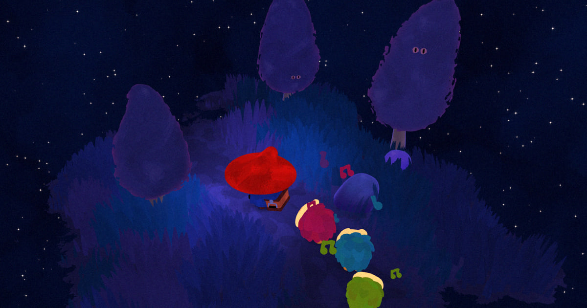

# Utanomori



A painterly night-forest game built with React Three Fiber. You walk an endless procedural forest,
find three music spirits, and play each one's melody back on a set of singing stones.

**Live: [mesq.me/utanomori](https://mesq.me/utanomori/)** · desktop + mobile · best with headphones
Built for the [Three.js Journey](https://threejs-journey.com/) challenge.

## Gameplay

- **WASD**/arrows to walk, **Shift** to run, on-screen joystick on touch.
- An arrow points at the current spirit from any distance — the forest has no map.
- Press **E** in range: coloured stones rise in an arc and the spirit plays a melody, lighting one
  stone per note.
- Click the stones back in order. Three rounds, each longer than the last.
- Win and the spirit follows you, its backing track joining the mix permanently. Miss and it
  relocates — the arrow just repoints.
- Three spirits completes the song, then the finale and credits.

`#debug` in the URL opens the Leva panel: one section per subsystem, covering the whole look,
from grass blade width to film grain.

## Technical highlights

**Endless terrain, nothing stored.** 9-unit chunks stream in a 5×5 resident grid, one chunk built
per frame so crossing a boundary never spikes. Every tree, stone, mushroom, grass patch and road
segment comes from seeded world-space samplers — deterministic, identical across machines, no
persisted world data.

**~40,000 grass blades, one draw call per chunk.** The geometry has no position attribute; blades
are generated in the vertex shader from `gl_VertexID`, with per-blade patch data baked CPU-side.
Wind, footstep trample, a fading trail, lean-away from props and a lantern dissolve all run in the
vertex stage. Blades inside a prop's clearance are culled by collapsing them to degenerate
triangles rather than discarding fragments.

**One `BatchedMesh` for the whole forest.** Trees, stones and mushrooms across all chunks share a
single batched mesh (4,096 instances), with a second pool for tree eye planes.

**Screen-space see-through.** Occluders fade a hole where the hero or a companion stands behind
them, driven by a `vec4[]` uniform of screen discs and applied consistently to props and the eyes
painted on trunks (grass too, behind a toggle that ships off).

**Painterly shading in the materials, not in post.** One brush texture, sampled three ways by four
hand-written `ShaderMaterial`s: object-space triplanar on characters and props, world-space on
ground and grass, and blended toward screen space only on the dissolve edges — where an
object-space dither would streak across curved surfaces as the reveal circle sweeps past. Ground
and grass read a copy blurred and levelled once into a render target at load, so their large flat
areas break into painterly regions. The only authored full-screen pass is a colour grade plus film
grain (SMAA sits after it).

**Masked day/night transition.** Themes don't swap in a frame — a torn-edged circle sweeps the
screen with the outgoing palette outside and the incoming one inside. Every themed material carries
both values plus a shared mask uniform, blended per fragment.

**Procedural eyes.** The hero's eyes are drawn in-shader with simplex-noise borders, blink and
glance, bound to his head bone. Trees use the same technique in a sibling shader, on a per-tree
random subset of authored planes, so no two trees match.

**Sample-locked audio.** Six backing layers (full + simplified mix per spirit) start at one
timestamp and are only ever volume-mixed, never stopped, so they stay in sync for the whole
session. Loading is tiered: only the base ambience blocks the start button.

**Split bundle.** A ~193 KB entry chunk containing no three.js paints the loading screen while the
~1.6 MB world chunk downloads behind it. The loading ring you watch fill is the hero's hat, live in
3D from directly above.

## Stack

React 19 · @react-three/fiber v9 · three r177 · zustand · Leva · gsap · postprocessing · vite

## Running it

```bash
npm install
npm run dev      # vite dev server
npm test         # node --test
npm run build    # production build into dist/
npm run preview  # serve dist/ — needed because the build is based at /utanomori/
```

`#debug` in the URL opens the Leva panel. Opening `dist/index.html` from the filesystem shows a
blank page: `vite.config.js` sets `base: '/utanomori/'`, so use `npm run preview`.

## Docs

**[ARCHITECTURE.md](ARCHITECTURE.md)** — how the app is assembled, what runs in a frame, and the
constraints that fail silently if you break them. Worth a skim before changing anything.

## Credits

Music by Aleksandr Manin. Reference artwork by Kei Yotsuba. Course and inspiration: Bruno Simon's
Three.js Journey.

## License

[MIT](LICENSE) — the code and the 3D models. Use them, fork them, build on them; MIT just asks
that you keep the copyright notice with them.

The music is **not** covered: it was composed by Aleksandr Manin and is used here with permission.
The footstep SFX are Stormwave Audio (attribution is in the files' ID3 tags), and Bebas Neue ships
under the SIL Open Font License.
